# Sentinel — System Design (ARCHITECTURE)

> Engineering design document for the Sentinel agent — a **local-first security
> monitoring bot** that runs a 4B-parameter LLM inside a **6 GB VRAM** budget on
> consumer hardware. This is a **conceptual showcase**: it describes the
> architecture with Mermaid.js flow diagrams and ships no source code. Companion
> to [`README.md`](./README.md).
>
> Every constant, file path, and count in this document was verified against the
> codebase by parallel subagent exploration (2026-07-04).

---

## Table of Contents

1. [System Overview](#1-system-overview)
2. [Agent Core — ReAct FSM](#2-agent-core--react-fsm)
3. [Bypass Mechanism — Chain of Responsibility](#3-bypass-mechanism--chain-of-responsibility)
4. [Semantic Routing & Context Collapse](#4-semantic-routing--context-collapse)
5. [LLM Bridge & TPOT Circuit Breaker](#5-llm-bridge--tpot-circuit-breaker)
6. [Skills Engine & Absolute Sandboxing](#6-skills-engine--absolute-sandboxing)
7. [Memory Subsystem](#7-memory-subsystem)
8. [Async SQLite WAL Database Architecture](#8-async-sqlite-wal-database-architecture)
9. [Monitoring, Alerting & Threat Hunting](#9-monitoring-alerting--threat-hunting)
10. [OSINT Subsystem (Engine-in-Engine)](#10-osint-subsystem-engine-in-engine)
11. [Security & HITL](#11-security--hitl)
12. [Architectural Constraints & Gates](#12-architectural-constraints--gates)

---

## 1. System Overview

Sentinel is a local-first security monitoring bot for Windows. It watches
system metrics, enriches alerts with on-device LLM reasoning (KoboldCpp /
Qwen3.5-4B), and delivers findings via Telegram. The agent core uses a ReAct
loop with explicit FSM routing, **17 bypass handlers**, hybrid semantic+keyword
routing, a **15-skill engine**, and a 4-block initializer pipeline that
collapses context before the LLM ever sees a prompt.

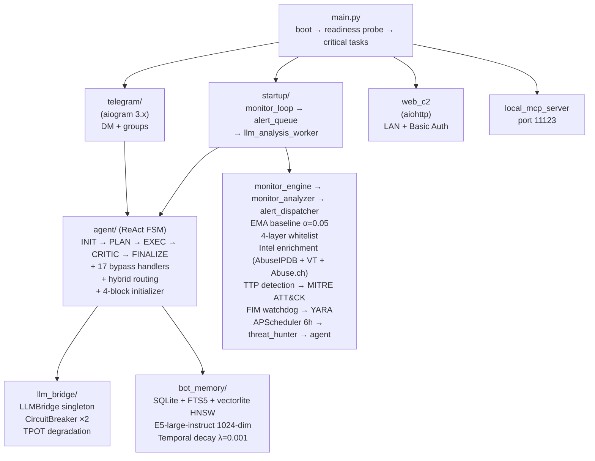

### 1.1 Identity

**Claw** — local AI assistant on-device via KoboldCpp. Hebrew-first, direct, no
filler. Personal assistant delivered via Telegram.

### 1.2 Project Metrics

| Metric | Value |
|--------|-------|
| Python source files (`services/`) | ~280 |
| Agent files (`services/agent/`) | 67 (28 root + 18 `_nodes/` + 19 `bypass/` + 3 `directives/` + 7 `routing/`) |
| Skills engine files (`_skills_engine/`) | 13 |
| Memory subsystem files (`bot_memory/`) | 12 |
| LLM bridge files (`llm_bridge/`) | 7 |
| Test files (`tests/`) | 132 (4,031 automated tests) |
| Skills | 15 (+ `_shared` library) |
| Bypass handlers | 17 |
| Scheduled jobs (APScheduler) | 15 (13 recurring + 2 startup pulses) |
| SQLite databases | 7 (WAL mode) |
| DB tables | 19 base + 3 virtual (vectorlite HNSW) |
| Agent FSM states | 6 |
| Tools in registry | 55 (system=24, file=5, memory=3, security=8, mcp=15) |
| Intent routers | 9 |
| MITRE ATT&CK techniques mapped | 13 |
| YARA rules | 5 |
| FIM watched extensions | 15 |
| Translation backends | 4 (opus-mt → MyMemory → deep-translator → LibreTranslate) |
| OCR engines | 1 (Tesseract 5.x — CPU-only, Hebrew + LTR) |
| Self-awareness verification layers | 4 (name → path → lineage → SHA256) |

### 1.3 Tech Stack

| Component | Technology |
|-----------|------------|
| Language | Python 3.12.2 (strict typing, Pydantic V2, async) |
| LLM | Qwen3.5-4B (Q4_K_S GGUF, ~2.1 GB weights) via KoboldCpp |
| Context window | 16,384 tokens (capped from native 262K by VRAM) |
| VRAM | 6 GB (RX 5600 XT) |
| Production RAM (Sentinel daemon) | ~323 MB RSS (measured via psutil, NSSM-managed Python process, 46 threads) |
| Embeddings | E5-large-instruct (1024-dim) |
| Vector search | vectorlite HNSW (`m=16, ef_construction=200, ef_search=64`) |
| Database | SQLite (WAL mode, 7 databases, aiosqlite 0.22.1) |
| Telegram | aiogram 3.x |
| Web dashboard | aiohttp (Basic Auth, IP whitelist, rate-limited) |
| Scheduler | APScheduler |
| Lint gates | ruff, xenon, import-linter, vulture, mypy, bandit, file-length, pip-audit, lock-sync (+ radon CC report) |

---

## 2. Agent Core — ReAct FSM

**Location**: `services/agent/` (67 files across root, `_nodes/`, `bypass/`,
`routing/`, `directives/`)

### 2.1 FSM State Machine

The agent is an explicit finite state machine. Each node declares its successor
via a returned state enum — there is no hidden control flow. The state registry
lives in `_state_handlers.py`.

| State | Node File | Responsibility | Transitions |
|-------|-----------|----------------|-------------|
| `INITIALIZE` | `_nodes/_initializer.py` (192 lines) | Build context, check bypasses, LLM readiness, tool selection, memory injection, pre-compute enrichment, context collapse | → `PLANNER` (if tools), → `FINALIZE` (if bypass/no tools) |
| `PLANNER` | `_nodes/_planner.py` (59 lines) | Task decomposition, DAG topological sort, dynamic step allocation, emit initial DAG to C2 | → `EXECUTE` |
| `EXECUTE` | `_nodes/_executor.py` (162 lines) | Single ReAct tick: LLM call → parse → tool execution, partition safe/critical, resource guard, loop detection | → `EXECUTE` (loop), → `CRITIC` (final_answer), → `ERROR` |
| `CRITIC` | `_nodes/_critic.py` (364 lines) | CoVe evaluation, entity audit, tool claim audit, circuit breaker, context compression for retry | → `FINALIZE` (pass), → `EXECUTE` (retry ≤2), → `FINALIZE` (circuit breaker fallback) |
| `FINALIZE` | `_nodes/_finalizer.py` (82 lines) | Store conversation, persist lessons, temp file cleanup | → TERMINAL |
| `ERROR` | `_nodes/_finalizer.py` (lines 44-82) | Graceful degradation, salvage tool data on max-steps | → `FINALIZE` (if salvageable), → TERMINAL |

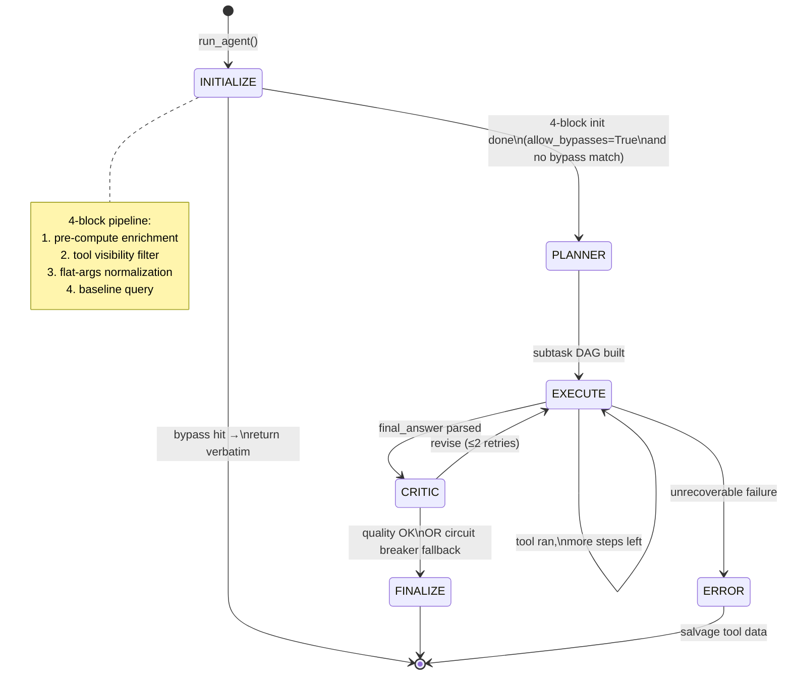

### 2.2 ReAct Loop — Step by Step

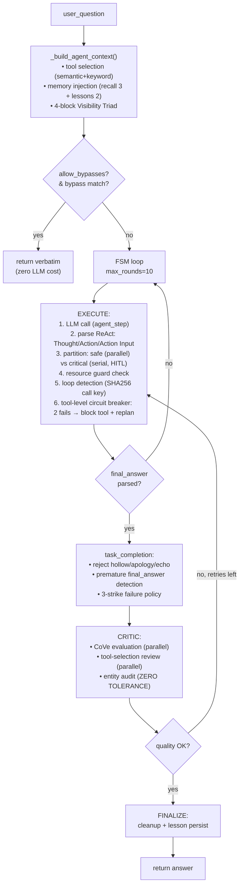

### 2.3 Critical Constants

| Constant | Value | Location | Purpose |
|----------|-------|----------|---------|
| `max_rounds` | 10 (default), 6 (Threat Hunter) | `_agent_loop.py:165` | FSM iteration cap |
| `_CRITIC_MAX_RETRIES` | 2 | `_context.py:22` | Critic revision attempts |
| `_RESERVE_STEPS` | 2 | `_agent_loop.py:23` | Emergency step reserve for critic retry on final subtask |
| Recovery nudge step | `max_steps - 1` | `_agent_loop.py:70` | Forces `final_answer` synthesis |
| `_RETRY_COLLAPSE_THRESHOLD` | 200 chars | `_nodes/_critic.py:187` | Detect collapsed retry drafts |
| Thought-leak threshold | 1500 chars | `_react_parser.py:210` | Salvage thought → final_answer |

### 2.4 ReAct Parser

**File**: `_react_parser.py` (235 lines)

The 4B model does not reliably emit JSON-schema tool calls. The parser treats
ReAct output as **free text** with regex extraction:

1. **Textual format** (`_try_parse_textual_react`): extracts `Thought:` /
   `<thinking>` blocks, `Action:` and `Action Input:` blocks. Handles multiple
   tool calls per response.
2. **Legacy JSON fallback** (`_try_parse_legacy_json`): backward compatibility
   for old JSON-schema output (parses ```json``` code blocks).
3. **Action Input parsing** (`_parse_action_input`, 5 layers):
   - Layer 1: Direct JSON parse
   - Layer 2: Strip trailing commas, retry
   - Layer 3: Handle string literal (JSON wrapped in quotes)
   - Layer 4: For `final_answer`, wrap raw text
   - Layer 5: Error feedback with `CRITICAL_ERROR` field
4. **Salvage logic** (`_handle_no_action`): salvages thought field to
   `final_answer` if >1500 chars. Rejects `<tool_output>` echo blocks to prevent
   hallucinated tool output being salvaged as an answer.

> **Key fix** (see `tasks/lessons.md`): `<thinking>` blocks are **never**
> salvaged into `final_answer.text`. Only explicit `Thought:` content is
> eligible. This prevents the model's internal planning monologue from leaking
> into the user answer.

### 2.5 No-React Auto-Correction Tracker

**File**: `_noreact_tracker.py` (128 lines)

Detects repeated ReAct format collapse and injects an aggressive format
directive.

| Constant | Value | Purpose |
|----------|-------|---------|
| `_WINDOW_SECONDS` | 3600 (1 hour) | Sliding window for collapse counting |
| `_THRESHOLD` | 3 | Collapses in window → inject aggressive directive |

Singleton state with thread-safe lock. The aggressive directive (lines 35-50)
forces stronger ReAct format enforcement on subsequent calls.

### 2.6 Provenance & Execution Gate

**File**: `_provenance.py` (214 lines)

Tracks the origin of every entity (PID, IP, file path) in agent reasoning to
prevent hallucinated execution actions.

| Category | Count | Examples |
|----------|-------|----------|
| `TRUSTED_SYSTEM_TOOLS` | 20 | WMI/psutil/netsh system sensors |
| `TAINTED_EXTERNAL_TOOLS` | 9 | web_search, osint_hunt, skills |
| `EXECUTION_ACTIONS` | 5 | terminate_process, block_ip, etc. |

`verify_execution_gate()` blocks tainted-only entities from triggering
execution actions — a PID that only appears in web_search output cannot be
killed.

### 2.7 Dynamic ReAct Budget

**File**: `react_budget.py` (96 lines)

`compute_budget(topic)` scales the iteration count by linguistic complexity:

| Signal | Budget delta |
|--------|--------------|
| Base | 5 |
| Multi-word topic (>3 words) | +1 |
| Complex keywords (APT, campaign, zero-day, ransomware, lateral, persistence, exfiltration, c2, …) | +2 |
| IOC candidates in topic | +1 |
| Hint: `has_iocs` | +1 |
| Hint: `is_apt` | +2 |
| **Clamp** | **3 ≤ budget ≤ 10** |

### 2.8 Tool Ranker (Closed-Loop Learning)

**File**: `_tool_ranker.py` (194 lines)

Ranks tools before the LLM sees them (exploits SLM primacy bias). Scoring
formula:

```
base = clamp(100 - decayed_failures*10 - decayed_repeats*5, 10, 100)
score = base + lesson_bonus          # bonus lifts ABOVE cap
tie_breaker = md5(name)[:8] / 0xFFFFFFFF   # deterministic float [0,1)
sort key = (score desc, tie_breaker desc)
```

The cap+floor is applied to the penalty-adjusted base BEFORE the lesson
bonus is added — so the bonus always lifts above the cap (100+20=120),
never absorbed by the floor. The hash-based tie-breaker ensures that
when all tools score equally (the common all-clean case), the sort
produces a deterministic non-insertion-order permutation instead of a
stable no-op.

| Constant | Value | Purpose |
|----------|-------|---------|
| `_FAILURE_PENALTY` | 10 | Per failure (decayed) |
| `_REPEAT_PENALTY` | 5 | Per repeat (decayed) |
| `_LESSON_BONUS` | 20 | Per learned lesson (added after cap) |
| `_SCORE_FLOOR` | 10 | Minimum base (before bonus) |
| `_SCORE_CAP` | 100 | Maximum base (before bonus) |
| `_HALF_LIFE_DAYS` | 7.0 | Exponential decay (prevents ghost penalty) |

### 2.9 Resource Guard

**File**: `resource_guard.py` (154 lines)

First-principles validation before heavy tool calls.

| Threshold | Value | Effect |
|-----------|-------|--------|
| `CPU_WARN` | 50.0% | Warn (log only) |
| `CPU_BLOCK` | 75.0% | Block heavy tools |
| `RAM_WARN` | 80.0% | Warn (log only) |
| `RAM_BLOCK` | 90.0% | Block heavy tools |
| `Z_WARN` | 1.5 | Z-score warning (never blocks) |

**Heavy tools** (6 explicit + pattern match): `web_search`, `fetch_url`,
`screenshot`, `file_search`, `skill_intel-skill`, `skill_report-maker`,
`skill_osquery-skill` — plus any tool starting with `skill_` or `fetch_`.

### 2.10 Branch Rules (Threat Hunt Inject)

**File**: `_branch_rules.py` (159 lines)

Conservative branch decisions for threat hunting. `_SKIP_RULES` and
`_NO_ANOMALY_RULES` are empty (disabled — false positives worse than false
negatives). `_INJECT_RULES` (4 rules):

| Trigger | Inject |
|---------|--------|
| C2 port 4444 detected | Memory scan |
| Suspicious IOC flag | IOC enrichment |
| High TTP score (≥80) | Deep analysis |
| Malicious PID | Process detail fetch |

### 2.11 Injection Anomaly Scorer

**File**: `_injection_anomaly.py` (389 lines)

Dynamic prompt-injection anomaly scoring (Layer 3b beyond static regex).

| Signal | Weight | Detection |
|--------|--------|-----------|
| Imperative-verb density | 0.35 | 89 verbs (lines 44-91) |
| Role-marker structural anomaly | 0.25 | Generic "Word:" pattern |
| Directive punctuation | 0.15 | `>>>`, `=>`, `->`, `!!!` |
| Instruction-shape lines | 0.15 | Lines matching instruction shape |
| Shannon entropy | 0.05 | Entropy of input |
| Mixed-script detection | 0.05 | Latin + Hebrew + Cyrillic + CJK |

| Threshold | Value |
|-----------|-------|
| `_LOW_THRESHOLD` | 0.25 |
| `_HIGH_THRESHOLD` | 0.45 |

`_BENIGN_SYSTEM_LABELS` (191 labels) excludes PID, CPU, RAM, etc. from
anomaly scoring.

### 2.12 Tool Audit

**File**: `_agent_tool_audit.py` (274 lines)

Deterministic tool-claim audit — detects fabricated tool references and
entities not present in tool data.

- `_TOOL_REF_RE`: pattern for tool names with `get_`/`sentinel_`/`skill_` prefix
- Entity patterns: `_PID_RE`, `_IPV4_RE`, `_FILEPATH_RE` (Windows/Unix paths
  with security extensions)
- `_IP_WHITELIST`: 4 IPs exempt from audit
- `_BENIGN_PROVIDER_PREFIXES`: 20 prefixes (Google, MS, Cloudflare, Apple, AWS)
- `extract_auditable_ips()`: public IPs subject to entity audit

### 2.13 Supporting Node Files

| File | Lines | Responsibility |
|------|-------|----------------|
| `_nodes/_executor_phases.py` | 338 | LLM call, partition, resource guard, execution phases |
| `_nodes/state_manager.py` | 236 | Subtask state transitions, prompt injection, no-tool-call handling |
| `_nodes/loop_controller.py` | 120 | Loop detection (SHA256 call key) and subtask-aware recovery |
| `_nodes/task_completion.py` | — | Final answer handling |
| `_nodes/no_tool_handler.py` | — | No-tool-call handling |
| `_nodes/circuit_breaker.py` | — | Self-healing tool-level circuit breaker |
| `_nodes/late_binding.py` | — | Task placeholder resolution |
| `_nodes/temp_file_bridge.py` | — | Temp file management for data-consuming skills |

---

## 3. Bypass Mechanism — Chain of Responsibility

**Location**: `services/agent/_bypasses.py` (175 lines) +
`services/agent/bypass/` (19 files)

The bypass system is a chain of responsibility with **17 handlers**. When
`allow_bypasses=True`, the dispatcher tries each handler in priority order; the
first match calls the target tool/skill **directly** and returns the result
**verbatim** — no LLM round-trip, no tool-selection hallucination.

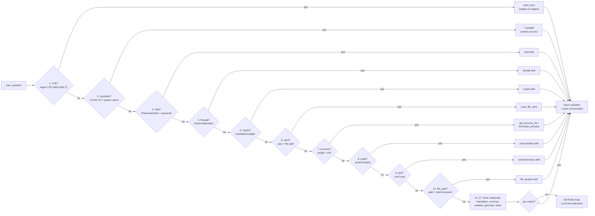

### 3.1 The 17 Handlers

| # | Handler | Detection | Routes To |
|---|---------|-----------|-----------|
| 1 | cve | `_is_cve_query` (regex `CVE-\d{4}-\d{4,7}`) | `osint_hunt` (engine-in-engine) |
| 2 | sysreport | keyword match (דוח מערכת / system report) | 7 parallel system sources |
| 3 | intel | `_detect_intel_query` (IP/domain/hash + keywords) | intel-skill |
| 4 | firewall | block/unblock/list keywords | firewall-skill |
| 5 | crypto | hash/b64/uuid/jwt regex | crypto-skill |
| 6 | yara | `_is_yara_query` (yara + file path) | `scan_file_yara` |
| 7 | process | `_is_process_query` (list/kill + PID) | `get_process_list` / `terminate_process` |
| 8 | pcap | `_is_pcap_query` (.pcap/.pcapng) | pcap-analyst skill |
| 9 | eml | `_is_eml_query` (.eml/.msg) | email-forensics skill |
| 10 | file_path | `_is_file_path_query` (path + intent keyword) | file_analyst skill |
| 11 | stock | ticker + stock/price keywords | stocks-skill |
| 12 | elaborate | תפרט/expand/continue | memory recall |
| 13 | translation | keyword match (3-case intent) | translator-skill |
| 14 | currency | currency conversion regex | currency-skill |
| 15 | weather | מזג אוויר/weather/תחזית | weather-skill |
| 16 | geocode | route/distance/forward patterns | geocode-skill |
| 17 | news | topic keyword match (gated by `ENABLE_NEWS_BYPASS`) | news-monitor skill |

### 3.2 Bypass Order Rationale

The order is **precision-critical** and prevents misrouting:

| Rule | Prevents |
|------|----------|
| CVE before intel | `CVE-2024-3094` matching as an IOC lookup |
| Intel/Firewall before stock | `8.8.8.8` matching as a stock ticker |
| YARA/pcap/eml before file_path | A `.pcap` file matching the generic file-analyst bypass |
| Hash requires intent keywords | A 32-char hex string alone is not a hash query — needs "malware"/"reputation"/"scan" co-occurrence |

When `allow_bypasses=False` (Threat Hunter), all handlers are skipped → full
ReAct loop. Proactive hunts must not short-circuit.

---

## 4. Semantic Routing & Context Collapse

**Location**: `services/agent/routing/` (7 files)

A 4B model is a tool-selection liability. Given 55 tools it will hallucinate
tool names, pick the wrong one, or chain three tools when one would do. Sentinel
solves this with a **three-stage deterministic pipeline** that runs *before* the
LLM sees the prompt.

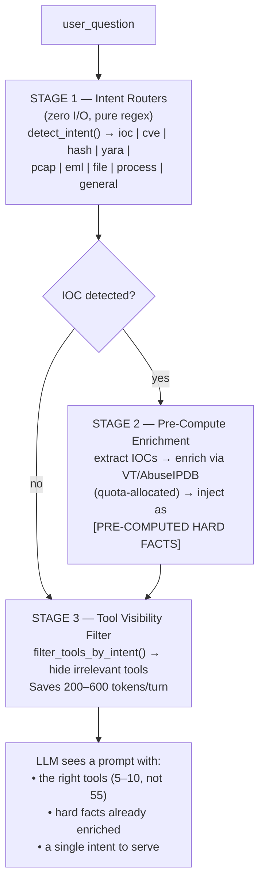

### 4.1 Tool Router

**File**: `routing/tool_router.py` (106 lines)

Hybrid semantic + keyword routing with interleaved deduplication.

| Step | Mechanism | Max results |
|------|-----------|-------------|
| 1 | Keyword substring match against `_TOOL_KEYWORD_MAP` | — |
| 2 | Cosine similarity against pre-computed tool vectors | — |
| 3 | Interleave keyword + semantic hits, deduplicated | 5 (default) |

### 4.2 Skill Router

**File**: `routing/skill_router.py` (154 lines)

| Step | Mechanism | Max results |
|------|-----------|-------------|
| 1 | Semantic filter: cosine similarity against skill embeddings | — |
| 2 | Keyword match against `_SKILL_KEYWORD_MAP` | — |
| 3 | Special signals (tickers NVDA/AAPL, file+translate combos) | — |
| 4 | Merge: semantic first, keyword fills gaps | 12 (default) |

### 4.3 Embedding Thresholds

**File**: `routing/embeddings.py` (94 lines)

| Constant | Value | Purpose |
|----------|-------|---------|
| `_SKILL_SIMILARITY_THRESHOLD` | 0.815 | Skill semantic match cutoff |
| `_SKILL_RELATIVE_DELTA` | 0.030 | Relative delta for skill selection |
| `_CONVERSATIONAL_SIMILARITY_THRESHOLD` | 0.65 | Conversational match cutoff |

`init_skill_embeddings()` and `init_tool_embeddings()` pre-compute vectors at
startup (lines 31-64 and 67-94).

### 4.4 Keyword Maps

**File**: `routing/keywords.py` (255 lines)

| Map | Count | Purpose |
|-----|-------|---------|
| `_CONVERSATIONAL_KEYWORDS` | 43 phrases | Detect conversational queries |
| `_CAPABILITY_PATTERNS` | 20 patterns | Capability detection |
| `_SYSTEM_KEYWORDS` | 163 terms | System intent keywords |
| `_STRICT_GREETING_PHRASES` | 5 phrases | Strict greeting detection |

**Hebrew normalization** (`hebrew_norm.py`): prefix stripping (בהולמשכ),
conservative (word ≥4 chars, remainder all Hebrew). Pre-computed normalized
keyword sets at import time.

### 4.5 Directives

**Location**: `services/agent/directives/` (3 files)

Open-Closed Principle: drop a new module, call `register()`. Matcher contract:
`(user_question: str, context: Dict) -> Optional[str]`. Priority-based
(lower value = higher precedence), first-match-wins dispatch.

| Directive | Priority | File | Triggers When |
|-----------|----------|------|---------------|
| News | 10 | `news.py` (42 lines) | News topic detected AND news tool in active set. Forces verbatim skill call + preserves `[title](URL)` format. |
| Staleness | 100 | `staleness.py` (50 lines) | `history_msgs > 0` AND active_tools intersect `LIVE_DATA_TOOLS` (7 tools). Warns LLM that prior conversation data is stale for volatile metrics. |

---

## 5. LLM Bridge & TPOT Circuit Breaker

**Location**: `services/llm_bridge/` (7 files)

| File | Lines | Purpose |
|------|-------|---------|
| `bridge.py` | 132 | LLMBridge singleton |
| `circuit_breaker.py` | 113 | Stateful circuit breaker + TPOT EMA + force_open |
| `completion.py` | 211 | Chat completion + agent_step workers |
| `embeddings.py` | 79 | Embedding calls worker |
| `health.py` | 75 | Background health monitor |
| `models.py` | 35 | Constants, enums, exceptions |
| `__init__.py` | 12 | Re-exports |

### 5.1 Architecture

`LLMBridge` is a thread-safe singleton (double-checked locking) — a facade
delegating to stateless workers.

- **Two OpenAI clients**: `_client` (timeout=45s) + `_probe_client` (3s health)
- **Shared HTTP client**: `httpx.AsyncClient` (max_keepalive=2, max_connections=5)
- **Semaphore**: `asyncio.Semaphore(1)` — serializes all LLM calls (VRAM safety)
- **Two circuit breakers**: main CB + isolated embed CB

### 5.2 TPOT Circuit Breaker State Machine

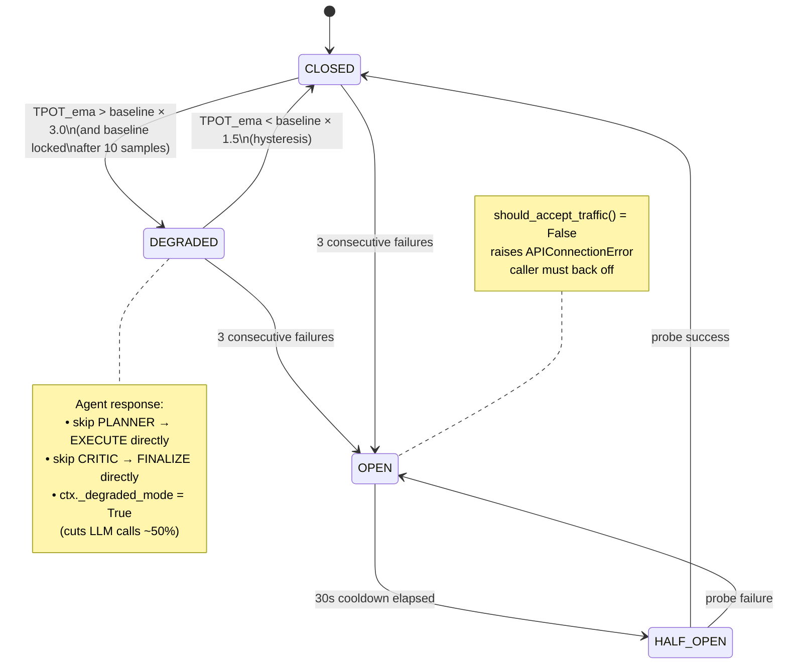

### 5.3 TPOT Measurement

```
tpot_ms = (effective_time / generated_tokens) × 1000
tpot_ema = 0.2 × tpot_ms + 0.8 × tpot_ema_prev        # EMA α=0.2
```

When available, **real decode time** is fetched from KoboldCpp's
`/api/extra/perf` endpoint (`prefill_time`, `decode_time`, `input_count`,
`output_count`) and takes priority over the heuristic. URL derived by stripping
`/v1` from `LLM_API_BASE` and appending `/api/extra/perf` (2s timeout).

| Constant | Value | Purpose |
|----------|-------|---------|
| `LLM_DEGRADED_MULTIPLIER` | 3.0 | TPOT above baseline × 3.0 → DEGRADED |
| `LLM_DEGRADED_CLEAR_MULTIPLIER` | 1.5 | TPOT below baseline × 1.5 → CLOSED (hysteresis) |
| `LLM_EMA_ALPHA` | 0.2 | EMA smoothing factor |
| `LLM_BASELINE_SAMPLES` | 10 | Samples before baseline locks (avoids cold-start panic) |
| `LLM_MIN_TOKENS_FOR_TPOT` | 50 | Ignore samples below this (prefill dominates, TPOT noisy) |
| `LLM_CB_THRESHOLD` | 3 | Consecutive failures → OPEN |
| `LLM_OPEN_COOLDOWN` | 30 s | OPEN → HALF_OPEN wait |
| `LLM_HEALTH_INTERVAL` | 60 s | Health probe interval |
| `LLM_RETRY_ATTEMPTS` | 2 | Completion retry attempts |
| `LLM_TIMEOUT` | 45 s | Main client timeout |

### 5.4 LLM Request Lifecycle

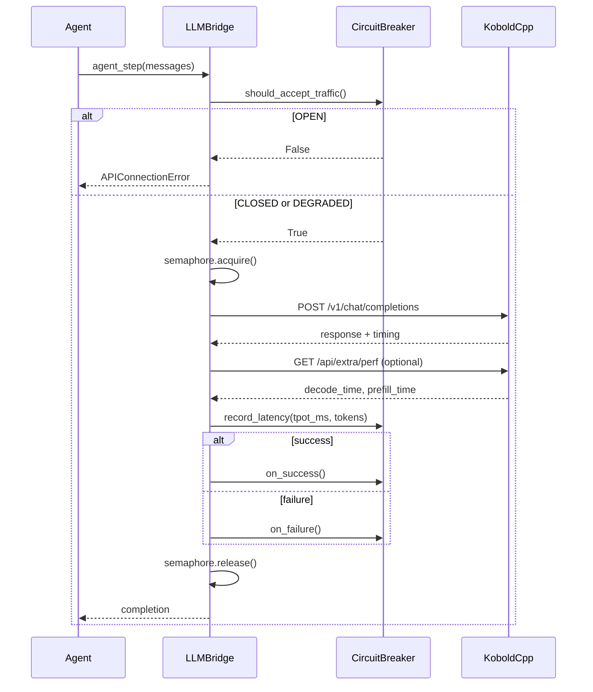

### 5.5 Health Loop & Priority Boost

**File**: `health.py` (75 lines)

Two-stage probe:
1. `models.list()` confirms HTTP endpoint is up
2. 1-token chat completion confirms model loaded in VRAM

On first success: sets `ready_event`, boosts KoboldCpp process priority to
`ABOVE_NORMAL_PRIORITY_CLASS` (0x00008000) on Windows — prevents CPU starvation
of the HTTP thread under 100% load. Uses psutil to find `koboldcpp.exe`.

### 5.6 response_format Fix (4B Deterministic Collapse)

The 4B model deterministically collapses when `response_format=json_object` is
set — KoboldCpp wraps plain-text in malformed JSON arrays. The fix (see
`tasks/lessons.md` 2026-06-16 + 2026-07-04):

- **`agent_step`** (`completion.py:195-197`): `response_format` removed
  entirely. ReAct output parsed as free-text with regex.
- **`memory_summarizer.py:146-149`**: explicit comment forbidding
  `response_format=json_object` (6 failures on 2026-07-04).
- **`complete()`** still accepts `response_format` parameter for callers that
  need it, but agent paths do not use it.

### 5.7 KoboldCpp Extensions

**File**: `completion.py` (lines 31-37)

```python
_EXTRA_BODY = {
    "top_k": LLM_TOP_K,                    # 20
    "min_p": LLM_MIN_P,                    # 0.05
    "chat_template_kwargs": {"enable_thinking": False},
}
```

`enable_thinking=False` disables Qwen3.5's thinking mode — the 4B model's
thinking blocks are unreliable and pollute the context window.

### 5.8 The 6 GB VRAM Constraint

Qwen3.5-4B natively supports a 262K-token context window. On 6 GB VRAM that is
a fantasy — the KV cache alone would consume the entire card. Sentinel solves
this with a **four-layer defense**:

| Layer | Mechanism | Constant |
|-------|-----------|----------|
| **Quantization** | Q4_K_S GGUF — weights compressed to ~2.1 GB | `Qwen3.5-4B-Q4_K_S.gguf` |
| **KV cache cap** | Context locked to 16K tokens with `quantkv q8_0` | `LLM_CONTEXT_WINDOW = 16384` |
| **Sliding-window trim** | Drops oldest assistant+tool pairs; protects system head, mid-conversation system messages, and current-turn user anchor | `LLM_AGENT_TRIM_CHARS = 8192` (50% of window) |
| **Emergency overflow** | On server-confirmed `context_length_exceeded`, hard-trims tool outputs to 100+50 chars (older) / 1200+500 chars (most recent) | `_emergency_trim_for_overflow()` |

**Tool-output floors prevent re-request loops**: the last tool output is never
shrunk below 1,000 chars (`_LAST_TOOL_FLOOR`), and older outputs shrink
progressively 500 → 250 → 125 chars. Without this floor, the 4B model would
re-request the same tool indefinitely because the truncated output no longer
contained the data it needed.

**Concurrency is serialized**: `asyncio.Semaphore(1)` around the LLM bridge
guarantees only one inference runs at a time — two concurrent 16K-context
prefills would OOM the card instantly.

---

## 6. Skills Engine & Absolute Sandboxing

**Location**: `services/_skills_engine/` (13 files)

| File | Lines | Purpose |
|------|-------|---------|
| `_engine.py` | 233 | SkillsEngine class, loading, registry, execution orchestration, caching |
| `models.py` | 237 | Skill dataclass (pure data, no logic) |
| `parser.py` | 122 | Extract commands and script paths from SKILL.md content |
| `security.py` | 283 | Security layer: validates commands + builds cmd_list with hard allowlists |
| `executor.py` | 85 | Dumb Executor — runs pre-validated cmd_list with aggressive timeout |
| `cli_builder.py` | 130 | JSON → CLI tokenization (Smart Builder) |
| `_output_validator.py` | 130 | Absolute Skill Sandboxing — schema-strict validation |
| `_output_router.py` | 43 | Exit-code → user-facing message routing |
| `_process_runner.py` | 58 | Subprocess lifecycle: spawn, wait with timeout, kill |
| `_truncator.py` | 89 | JSON-safe string truncation utility |
| `_yaml_parser.py` | 218 | YAML frontmatter parser with graceful fallback |
| `_cli_utils.py` | 64 | CLI argument parsing utilities |
| `_skill.py` | 6 | Deprecated shim (backward compat) |

### 6.1 Skills Loading Flow

**Entry Point**: `SkillsEngine._load_all()` (lines 64-89 in `_engine.py`)

1. **Directory scan**: iterates `skills/` subdirectories
2. **SKILL.md detection**: looks for `SKILL.md` in each skill directory
3. **Frontmatter parsing**: `parse_frontmatter()` from `_yaml_parser.py`
   - Primary: `yaml.safe_load()` (PyYAML)
   - Fallback 1: `ruamel.yaml`
   - Fallback 2: custom `SimpleYAML` pure-Python parser (handles scalars, lists, nested dicts, dotted keys)
4. **Skill instantiation**: creates `Skill` dataclass with metadata + body
5. **Registry storage**: `self._skills[skill.name]`

### 6.2 YAML Frontmatter Schema

```yaml
---
name: <skill-name>
description: <description>
metadata:
  clawdbot:
    emoji: <emoji>
    commands: [<cmd1>, <cmd2>, ...]
    arg_template: "scripts/script.py {command} {args}"
    command_to_args_template: "{...json...}"
    timeout: <seconds>              # default 30
    args_description: <string>
    requires:
      bins: [<binary>, ...]
      python_libs: [<package>, ...]
    install:
      - id: <id>
        kind: pip
        packages: [<pkg>, ...]
        label: <label>
        optional: true
    commands_schema:
      "*":                          # shared schema for all commands
        properties: {...}
        required: [...]
      <cmd>:                        # per-command schema
        properties: {...}
        required: [...]
---
```

### 6.3 Executor Flow

```
Skill.execute()
  ↓
cli_builder.parse_args() → (args_str, args_dict)
  ↓
cli_builder.apply_template() → args_str
  ↓
security.build_cmd_list() → cmd_list (validated)
  ↓
executor.run(cmd_list, cwd, timeout)        # "Dumb Executor" — 2 retries max
  ↓
_process_runner.spawn_and_wait() → (stdout_b, stderr_b, rc)
  ↓
_output_router.route_success/route_failure() → message
  ↓
_truncator.json_safe_truncate() → final output
```

**Caching**: TTLCache (128 entries, 45s TTL). Cache key: `(skill_name, command,
args, cwd)` normalized. Only caches successful results (not errors/timeouts).

**Concurrency**: `asyncio.Semaphore(3)` — max 3 concurrent skills.

### 6.4 Absolute Skill Sandboxing (Security)

**File**: `security.py` (283 lines)

Three-layer defense:

| Layer | Mechanism | Implementation |
|-------|-----------|----------------|
| **Binary allowlist** | Only known binaries may execute | `_KNOWN_BINS = {"python", "py", "python3", "python.exe", "py.exe"}`, `_ALLOWED_DIRECT = {"curl", "wget", "nmap", "ping", "tracert", "nslookup", "whois"}` |
| **Python code execution block** | Blocks `-c`, `-m`, `-x` flags | `security.py:156-157` |
| **Batch file block** | Blocks `.bat`, `.cmd` extensions | `security.py:52-53, 183-188` |

| Attack Class | Blocking Mechanism |
|--------------|-------------------|
| Shell Injection | `shell=False` in subprocess, `List[str]` only |
| Python Code Execution | Blocks `-c`, `-m`, `-x` flags |
| Batch File Injection | Blocks `.bat`, `.cmd` extensions |
| Path Traversal | `cwd` locked to skill directory |
| Arbitrary Binary Execution | Hard allowlist (`_ALLOWED_DIRECT`) |
| Missing Dependencies | `check_required()` validates bins + libs before execution |

### 6.5 Output Validation (Schema-Strict)

**File**: `_output_validator.py` (130 lines)

Policy: "JSON + whitelist text"

| Skill Set | Count | Skills |
|-----------|-------|--------|
| `TEXT_OUTPUT_WHITELIST` | 4 | file-analyst, web-scraper, translator-skill, report-maker |
| `JSON_REQUIRED_SKILLS` | 11 | intel-skill, news-monitor, pcap-analyst, email-forensics, persistence-hunter, crypto-skill, currency-skill, geocode-skill, stocks-skill, weather-skill, firewall-skill |

**Validation logic** (`validate_skill_output`):
1. Empty output → allowed
2. Skill in `TEXT_OUTPUT_WHITELIST` → approved (free text allowed)
3. All other skills → must be valid JSON
4. Invalid JSON → rejected with placeholder (`_TEXT_REJECTION_PLACEHOLDER` or
   `_REJECTION_PLACEHOLDER`)

### 6.6 Process Runner (Subprocess Sandboxing)

**File**: `_process_runner.py` (58 lines)

- **`shell=False`** — mandatory (no shell injection)
- **`cmd_list` must be `List[str]`** — no string commands
- **Environment isolation**: `PYTHONIOENCODING=utf-8`, `LANG=he_IL.UTF-8`
- **Timeout handling**: `asyncio.wait_for(process.communicate(), timeout)`,
  on timeout: `process.kill()`, `process.wait()`
- Returns sentinel `TIMEOUT` class on timeout

### 6.7 JSON-Safe Truncator

**File**: `_truncator.py` (89 lines)

LIFO state machine that scans for safe cut points at commas and closing
braces/brackets, tracks nesting stack (`{[` vs `}]`), ignores characters inside
strings. At each cut point, appends missing closing chars and validates with
`json.loads()` — returns first valid closure.

### 6.8 The 15 Skills

| # | Skill | Commands | Timeout | Requires (bins) | Requires (libs) |
|---|-------|----------|---------|-----------------|-----------------|
| 1 | crypto-skill | hash, b64, jwt, jwt-verify, password, uuid, hmac, phash, pverify, encrypt, decrypt, kdf | 30 | python | cryptography, PyJWT, argon2-cffi, bcrypt |
| 2 | currency-skill | run | 30 | python | requests |
| 3 | email-forensics | headers, auth, route, urls, full | 30 | python | html2text |
| 4 | file_analyst | summarize, extract, convert, stats, check, extract_tables, chart, contract, datasheet, analyze, ocr, ocr_translate, ocr_pdf, redact, batch, pdf_to_md | 90 | python | PyPDF2, pdfplumber, pdfminer.six, python-docx, openpyxl, pandas, pytesseract, Pillow, deep-translator, pymupdf |
| 5 | firewall-skill | block, unblock, list, drops, stats, block-cidr, block-port, unblock-port, whitelist, audit, sweep | 30 | python, netsh | — |
| 6 | geocode-skill | forward, reverse, distance, bbox, route, alternative | 30 | python | requests |
| 7 | intel-skill | ip, domain, hash, dns, whois, sweep, cluster, israeli, cert, attack, feeds | 30 | python | — |
| 8 | news-monitor | economy_il, news_il, cyber, tech_ai, world, security_mil, politics_il, sports, health, auto, realestate | 60 | python | feedparser, beautifulsoup4, aiosqlite, html2text, readability-lxml |
| 9 | pcap-analyst | analyze, dns, sni, iocs | 60 | python | scapy |
| 10 | persistence-hunter | scan, baseline, diff | 45 | python | — |
| 11 | report-maker | default, table, briefing, timeline, daily_digest, contract, watchlist, incident_report, security_audit | 60 | python | jinja2, markdown, weasyprint |
| 12 | stocks-skill | quote, history, news, crypto, watchlist | 30 | python | yfinance, pandas |
| 13 | translator-skill | run | 30 | python | requests, langdetect |
| 14 | weather-skill | run | 30 | python | requests |
| 15 | web-scraper | fetch, price, table, watch, batch | 30 | python | requests, beautifulsoup4, lxml, html2text |

### 6.9 Skill Health Service

**File**: `services/skill_health.py` (72 lines)

`SkillHealthService.pulse_all()` runs health checks on all skills, updates the
`_healthy` flag. Checks if result starts with error markers (❌, ⏱️, ⚠️,
[ERROR]). Logs state transitions (recovered/failed).

### 6.10 IOC Chaining Protocol

Skills can chain to `intel-skill` via JSON:

```json
{
  "iocs": {"domains": [...], "ips": [...], "urls": [...], "hashes": [...]},
  "source": "<skill-name>",
  "chain_to": "intel-skill",
  "stats": {...},
  "triage": "..."
}
```

Supported by: `email-forensics`, `pcap-analyst`. Triage layer
(`skills/_shared/ioc_triage.py`) filters private IPs, benign domains (~25
providers), and applies top-K selection (max 15 IOCs).

---

## 7. Memory Subsystem

**Location**: `services/bot_memory/` (12 files) + top-level memory modules

| File | Lines | Purpose |
|------|-------|---------|
| `archive.py` | 161 | Archive, restore, vacuum, cleanup |
| `crud.py` | 205 | MemoryService CRUD |
| `crud_search.py` | 185 | Search methods (FTS5 + decay) |
| `episodic.py` | 195 | Episodic event chains |
| `fts_manager.py` | 38 | FTS5 index management |
| `highlevel.py` | 202 | High-level public API |
| `maintenance.py` | 110 | Daily maintenance |
| `models.py` | 102 | Pydantic models |
| `numpy_cache.py` | 337 | In-memory Numpy vector cache |
| `schema.py` | 64 | SQLite schema initialization |
| `vector_manager.py` | 210 | Vectorlite HNSW vector search |
| `__init__.py` | 40 | Re-exports |

### 7.1 Vector Search (vectorlite HNSW)

| Parameter | Value | Purpose |
|-----------|-------|---------|
| Dimensions | 1024 | E5-large-instruct |
| `m` | 16 | Max connections per node |
| `ef_construction` | 200 | Build-time recall |
| `ef_search` | 64 | Query-time recall (~95%) |
| Distance | L2 (implicit) | Converted: `score = 1.0 / (1.0 + dist)` |
| Similarity threshold | 0.65 | Semantic search cutoff |

**Upsert pattern**: DELETE then INSERT (vectorlite doesn't support ON CONFLICT).
**Post-filter**: HNSW doesn't support WHERE on non-vector columns → filtered in
Python after over-fetch (×10).

### 7.2 Memory Recall — 3-Tier Fallback

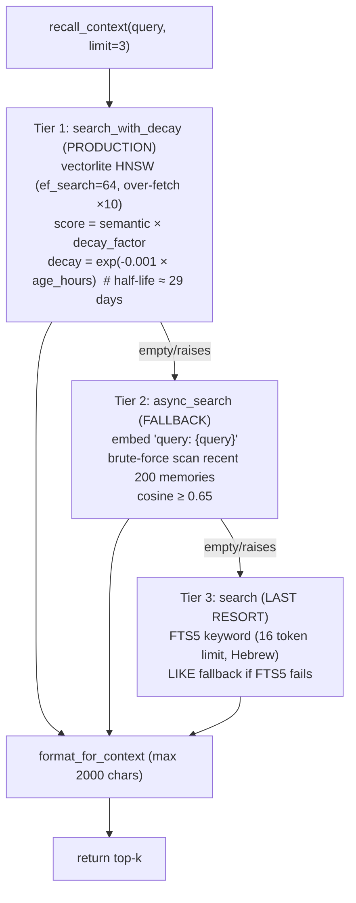

**Temporal decay**: `decay_lambda=0.001` per hour → half-life = ln(2)/0.001 =
693h ≈ 29 days. A 1-week-old memory loses ~15%, a 1-month-old loses ~50%.

### 7.3 Memory Write Path

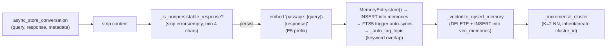

### 7.4 Numpy Vector Cache

**File**: `bot_memory/numpy_cache.py` (337 lines)

| Constant | Value | Purpose |
|----------|-------|---------|
| `_MAX_VECTORS` | 10000 | Boot-loads all vectors into Numpy matrix (N × 1024) |
| `_DECAY_LAMBDA` | 0.001 | Temporal decay per hour |
| `_SEMANTIC_THRESHOLD` | 0.65 | Cosine similarity cutoff |

L2-normalized for cosine similarity. Performance: 0.69ms per query for 10,000
vectors. Write-through: new memories `np.vstack`'d on store.

### 7.5 Embedding Service

**File**: `services/embedding_service.py` (205 lines)

- **Model**: `text-embedding-multilingual-e5-large-instruct` (1024-dim)
- **Prefixes required**: `query:` for search, `passage:` for storage
- **LRU cache**: maxsize 2048, TTL 86400s (24h)
- **Cache key**: SHA256 hash of normalized text (strips timestamps, message IDs,
  event IDs, case, whitespace)
- **Serialization**: `struct.pack(f"{len(v)}f", *v)` — 4 bytes per float,
  4096 bytes per 1024-dim vector

### 7.6 Episodic Memory & Escalation

- **Escalation detection**: ≥3 events of severity ≥2 in a 30-min window (per
  source + event_type)
- O(log N) COUNT via composite index `idx_events_escalation`
- Dedup: one escalation per `chain_id`
- Race-free chains: read-time `ORDER BY ts ASC` (no `prev_event_id`)
- Purge TTL: 7 days

### 7.7 Compaction Jobs

| Job | Schedule | Purpose |
|-----|----------|---------|
| `memory_summarization` | 02:30 daily | LLM merge of last 24h → `user_profiles` (JSON: preferences, topics, patterns, entities). `response_format=json_object` NOT set (4B collapse fix). Post-LLM `_normalize_profile` guards schema regression (carries over dropped keys from previous profile) + dedups list fields preserving order (fixes id=27→id=28 bloat: 87 prefs/47 dups, 3 dropped keys). |
| `night_watchman_compaction` | 05:00 daily | 30-day memories → LLM summaries (3-5 Hebrew bullets, `_MAX_CHUNK_CHARS=4000`) → archive originals |
| `memory_maintenance` | 04:30 daily | FTS5 integrity + embedding backfill + `wal_checkpoint(PASSIVE)` |

### 7.8 Specialized Memory Stores

| Store | DB | Decay / Threshold | Purpose |
|-------|----|-------------------|---------|
| `error_memory.py` | `error_lessons.db` (isolated, conn=2) | Dedup 0.90, search 0.82, scan limit 500 | Tool failure lessons (cosine-deduped). Consumed by `_tool_ranker`. Fire-and-forget. |
| `ioc_memory_store.py` | `ioc_memory.db` | Decay tau=14d (half-life ~9.7d), prune 90d | Per-IOC score timeline. `S_decayed = S_i * exp(-dt / tau)`. |
| `reference_store.py` | `reference.db` (mmap 256MB) | Similarity 0.65 | OSINT intel with embeddings, skill_state, pairing_codes. |
| `investigation_memory.py` | `reference.db` | Similarity 0.60 | ReAct loop steps (loop prevention via SHA256 hash + cross-run memory). |
| `osint_memory.py` | — | — | Re-export shim to `reference_store.py`. |

### 7.9 Memory Summarizer JSON Safety

**File**: `services/memory_summarizer_json.py` (247 lines)

- `_safe_parse_json()`: defense-in-depth parsing
- `_detect_repetition()`: detects 4B repetition loops
- `_close_brackets()`: closes open brackets in reverse order
- `_strip_markdown_ticks()`: strips ```json wrappers

---

## 8. Async SQLite WAL Database Architecture

**Location**: `services/db_pool.py` + 7 database modules

### 8.1 Multi-DB Layout

Sentinel uses **7 SQLite databases**, all in WAL mode, pooled via `DBPool`. The
split is deliberate — it isolates write-heavy hot paths from read-heavy cold
storage to eliminate lock contention.

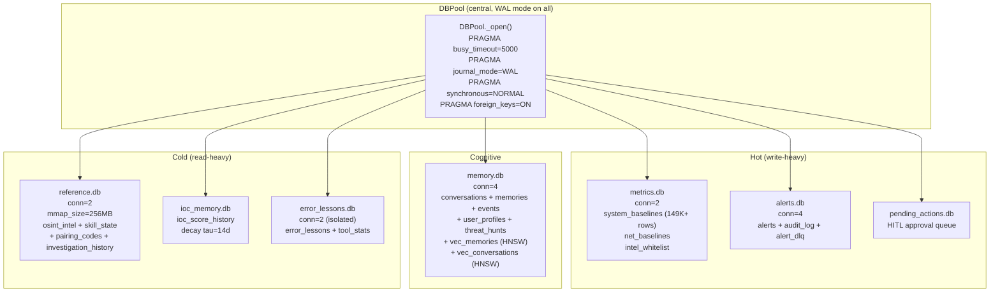

### 8.2 WAL Configuration

All connections go through `DBPool._open()` which applies these PRAGMAs at
connection time:

| PRAGMA | Value | Purpose |
|--------|-------|---------|
| `busy_timeout` | 5000 ms | Wait 5s for a lock before erroring (10s for migrations) |
| `journal_mode` | WAL | Readers never block writers, writers never block readers |
| `synchronous` | NORMAL | WAL writes synced; checkpoint to main DB may be delayed |
| `foreign_keys` | ON | FK constraints enforced |

**Checkpoint strategy**: `PRAGMA wal_checkpoint(PASSIVE)` runs daily at 04:30
via `run_memory_maintenance()`. PASSIVE mode is used (not TRUNCATE) because the
memory pool keeps up to 4 persistent connections — TRUNCATE requires exclusive
access (no reader may hold a WAL snapshot), which is impossible to guarantee in
a pooled environment and causes "database table is locked". PASSIVE checkpoints
as many frames as possible without waiting for readers, never fails, and still
bounds WAL size via frame reuse + SQLite's default autocheckpoint of 1000 pages.

### 8.3 Async Access Pattern

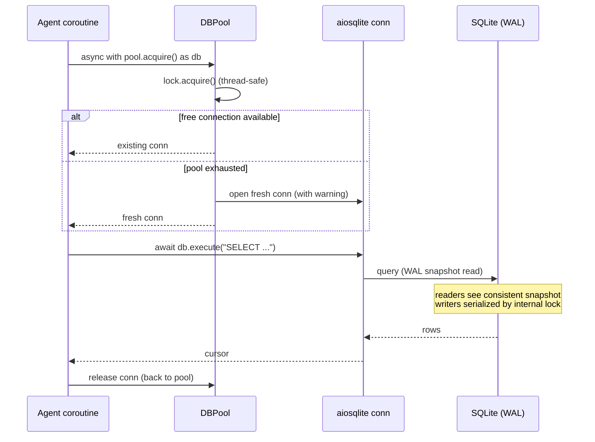

- **Library**: `aiosqlite==0.22.1`
- **Pool sizes**: memory.db=4, alerts.db=4, metrics.db=2, reference.db=2,
  error_lessons.db=2
- **Acquire pattern**: `async with pool.acquire() as db:` context manager
- **Fallback**: if pool exhausted, creates a fresh connection with a warning
- **Write serialization**: SQLite's single-writer WAL mode handles this
  automatically — no application-level write queues needed

### 8.4 Why 7 Databases?

| Separation | Reason |
|------------|--------|
| `metrics.db` ≠ `alerts.db` | 30s monitor cycle writes metrics constantly; user queries read alerts. Splitting eliminates write-lock contention. |
| `reference.db` ≠ `alerts.db` | Cold static tables isolated from alert write traffic. Uses `mmap_size=256MB` for read-heavy access. |
| `error_lessons.db` isolated | "Muscle memory" of past errors. Isolated pool (conn=2) so error writes never block cognitive memory. |
| `ioc_memory.db` separate | Per-IOC score timeline with exponential decay — small, hot, query-heavy. |
| `pending_actions.db` separate | HITL approval queue must survive restarts; isolated from cognitive store. |

### 8.5 Database Schema Summary

| DB | Table | Purpose |
|----|-------|---------|
| `memory.db` | `conversations` | Per-message store with embeddings |
| | `memories` + `memories_fts` | Q/A pairs + FTS5 full-text search (external content table + INSERT/DELETE/UPDATE triggers) |
| | `events` | Episodic event chains |
| | `user_profiles` | LLM-generated user summaries |
| | `threat_hunts` | Proactive hunt audit trail |
| | `schema_meta` | Schema version tracking |
| | `vec_memories` / `vec_conversations` | vectorlite HNSW (1024-dim) |
| `alerts.db` | `alerts` | Alert history with embeddings + intel |
| | `audit_log` | Tool execution audit trail |
| | `alert_dlq` | Dead-letter queue for failed dispatches |
| `metrics.db` | `system_baselines` | Time-series metrics (CPU, RAM, disk) |
| | `net_baselines` | Known process-IP-port combos (UNIQUE) |
| | `intel_whitelist` | Whitelisted IPs |
| `reference.db` | `osint_intel` | OSINT intel with embeddings |
| | `investigation_history` | ReAct loop steps (loop prevention + cross-run memory) |
| | `skill_state` | Skill state persistence |
| | `pairing_codes` | Pairing codes |
| `pending_actions.db` | `pending_actions` | HITL approval queue (composite target `{pid}\|{name}`) |
| `ioc_memory.db` | `ioc_score_history` | Per-IOC score timeline with decay (tau=14d, half-life ~9.7d) |
| `error_lessons.db` | `error_lessons` | Tool failure lessons with embeddings (dedup 0.90, search 0.82) |

**FTS5**: external content table on `memories` with INSERT/DELETE/UPDATE
triggers. Integrity check via
`INSERT INTO memories_fts(memories_fts) VALUES('integrity-check')`; auto-rebuild
on INSERT failure.

---

## 9. Monitoring, Alerting & Threat Hunting

### 9.1 Monitor → Alert Pipeline

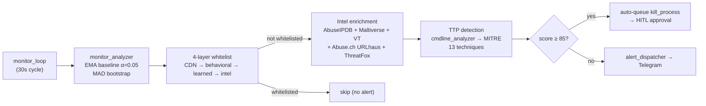

### 9.2 Monitor Engine

**File**: `services/monitor_engine.py` (91 LLOC)

- Collects system snapshots every 1s via `_cpu_sampler_daemon` (threading.Lock)
- Monitors: CPU, RAM, GPU, network, disk, top processes, suspicious processes
- Suspicious process names: "powershell.exe", "wmic.exe", etc.
- Critical thresholds from config: `CPU_THRESHOLD`, `RAM_THRESHOLD`,
  `SUSPICIOUS_NET_THRESHOLD`
- Snapshot includes `kobold_connections` (self-whitelisted count from
  `_collect_suspicious_net`) for connection-storm detection
- **Connection pre-filter** (`services/monitor_engine_helpers.py`,
  `_is_connection_filtered`, gates entry into `suspicious_net` before the
  threat classifier ever sees it): self-process → browser-on-standard-port →
  WhatsApp/Facebook XMPP (port 5222) → whitelisted-proc + known-good ASN/org.
  `_is_messaging_xmpp_to_facebook` matches live ASN (`32934`)/org
  ("facebook"/"meta") from `ip-api.com` enrichment, with a static
  `2a03:2880::/32` IPv6 CIDR fallback for when that enrichment call
  times out/fails (observed root cause of a `net:threat_suspicious`
  false positive on an IPv6 Facebook connection).

### 9.3 Monitor Analyzer

**File**: `services/monitor_analyzer_orchestrator.py` (214 LLOC)

- Statistical anomaly detection using SQLite baselines
- Sustained Z-score detection (metrics: "cpu", "ram")
- `SustainedZScoreDetector`: `required_cycles=3`, `threshold_z=3.0`
- **CPU spike process attribution**: `_top_cpu_procs()` pulls the top 3
  processes by `cpu_percent` from `snapshot['top_procs']` (same 1s sampler
  tick that produced the spiking value) and attaches them to
  `AnomalyEvent.details['top_procs']` + inline in `reason`
  (`"... | Top CPU: MsMpEng.exe (18.2%), ..."`). Gives the analyst/LLM a
  deterministic culprit instead of guessing from the Z-score alone. CPU
  spikes only — RAM is not attributed (`top_procs` tracks CPU%, not RSS).
- Safe processes: `msmpeng.exe`, `searchindexer.exe`, `dwm.exe`, `devin.exe`, `python.exe`,
  `widgets.exe`, `taskhostw.exe`, `backgroundtaskhost.exe`, `searchapp.exe` — all gated by
  `_SAFE_PROCESS_CPU_CEILING = 80.0` (`_PYTHON_CPU_CEILING = 70.0` for python.exe).
  `SnapshotDiffer._is_safe_noise()` applies this ceiling to BOTH new-process and
  existing-process-spike detection branches (`monitor_analyzer.py`).
- Anomaly gating: `IDLE_CPU_THRESHOLD = 2.0`, `RAM_DROP_ABS_PCT = 40.0`,
  `RAM_DROP_Z_THRESHOLD = 10.0`
- **Absolute physical-danger floor** (`ABS_SPIKE_FLOOR = {"cpu": 40.0, "ram": 60.0}`,
  `monitor_analyzer.py`): a monstrous Z-score on a quiet baseline (e.g. z=11.4 for
  CPU=26.1% vs μ=3.3%, from a routine background scan) is a statistical curiosity,
  not a threat, when the metric is nowhere near physically dangerous. Spikes below
  the floor are gated in `_build_anomaly_event` (logged at DEBUG, never dispatched)
  regardless of Z-score magnitude — applies to spikes only, not drops.
- **Connection storm protection**: shared `_custom_http_client` in
  `bridge.py` (`max_connections=5`) is the sole defense.  The prior
  `on_connection_storm` IoC (counting self-whitelisted benign connections,
  threshold 10) was removed 2026-07-07 — it caused a self-DoS oscillation.
- **5-layer network connection whitelist** (delegated to
  `services/net_noise_filter.py`, 154 lines — SSOT `suppression_reason()`
  shared with the threat hunter): CDN/cloud CIDR (incl. Azure 13.64.0.0/11) →
  self-process → expected behavior → learned baseline → intel whitelist.
  DB-backed layers fail-open (lookup error → alert survives).

### 9.4 EMA Baseline

**File**: `services/ema_baseline.py` (200 LLOC)

`GatedEMABaseline` — poisoning-resistant EMA with Z-score gate.

| Constant | Value | Purpose |
|----------|-------|---------|
| `_EMA_ALPHA` | 0.05 | EMA smoothing factor |
| `_GATE_Z_SAFE` | 1.5 | Z-score gate (rejects outliers) |
| `_INITIAL_VAR` | 9.0 | Initial variance |
| `_MIN_STD` | 2.0 | Minimum standard deviation |
| `_WARMUP_COUNT` | 20 | Warmup samples before Z-gate active |
| `_REBOOTSTRAP_CONSECUTIVE` | 10 | Consecutive gated samples → rebootstrap |
| `_REBOOTSTRAP_MAGNITUDE` | 0.5 | Reject reboot if \|Δμ\|/μ > 50% (transient spike guard) |
| `_GATED_RING_SIZE` | 20 | Ring buffer for gated samples (median rebootstrap) |

Re-bootstrap guards (3-tier, extracted to `_maybe_rebootstrap()`):
1. **Co-tenant suppression** — when `BaselineStore._cotenant_active()` detects
   `MONITOR_PROCESS_EXCLUSIONS` processes (DEVIN, Windsurf, cascade, LSP) using
   ≥5% CPU collectively, re-bootstrap is suppressed and the idle baseline is
   preserved.  Threshold: `_COTENANT_CPU_THRESHOLD = 5.0` in `monitor_analyzer.py`.
2. **Magnitude guard** — reject re-bootstrap if the jump exceeds 50% of the old
   baseline (a transient spike must not become the new normal).
3. **Median of gated samples** — uses the ring-buffer median instead of the last
   anomalous value (robust to outliers).

Stores baselines in `memory/ema_baselines.json`.

### 9.5 Alert Dispatcher

**File**: `services/alert_dispatcher.py` (235 lines)

| Constant | Value | Purpose |
|----------|-------|---------|
| `_PASS_SEVERITIES` | critical, warn, suspicious, malicious | Severity gate |
| `cooldown_seconds` | 900.0 (15 min) | Per-alert cooldown |
| `rate_limit_window` | 600.0 (10 min) | Rate-limit window |
| `max_alerts_per_window` | 3 | Max alerts per window |
| Auto-queue threshold | score ≥ 85 | Auto-queues block actions for IPs |

### 9.6 Alert DLQ

**File**: `services/alert_dlq.py` (163 lines)

Dead-letter queue for failed alert dispatches using `alerts.db`. Retry with
exponential backoff: `_MAX_RETRIES = 8`, `_BACKOFF_CAP_MIN = 64` seconds.

### 9.7 Self-Whitelist (4-Layer)

**File**: `services/self_whitelist.py` (315 lines)

Prevents the agent from detecting its own processes.

| Layer | Check |
|-------|-------|
| 1 | Process name (`_SELF_PROC_NAMES`: koboldcpp.exe, python.exe) |
| 2 | Executable path (`_SELF_PATH_FRAGMENTS`: tactical_bot, sentinel) |
| 3 | Process lineage |
| 4 | SHA256 hash |

Cache TTL: `_CACHE_TTL = 60` seconds.

### 9.8 Intel Enrichment

| File | Lines | Purpose |
|------|-------|---------|
| `intel_enricher.py` | 359 | Auto-enrichment via intel-skill APIs (AbuseIPDB, VirusTotal, Maltiverse). Timeout 7.0s, VT concurrency cap 4. Trusted-ISP cross-validation: cloud IP (Microsoft/Google/AWS/…) + verified VT=0 + no feed hit → CLEAN even at AbuseIPDB=100. IOC score persistence via `_fire_and_forget` (strong-ref + exception logging). |
| `net_noise_filter.py` | 154 | SSOT benign-connection suppression chain (CDN → self → behavioral → learned baseline → intel whitelist). Used by SnapshotDiffer AND threat hunter (`apply_snapshot_noise_filter`). |
| `ip_enrich.py` | 111 | Local GeoIP/ASN via geoip2 .mmdb (air-gapped, zero external APIs). LRU cache 1024. |
| `threat_feeds.py` | 199 | Abuse.ch (URLhaus + ThreatFox). Cache TTL 24h. |
| `threat_classifier.py` | 125 | Network threat intel: port classification, connection graph, LLM summary. |
| `threat_score_cap.py` | 57 | LLM hallucination guard. `_SCORE_CAP_NO_EVIDENCE=0.5`, `_SCORE_CAP_BASE=0.6`, requires `_EVIDENCE_MIN_SOURCES=2`. |
| `ioc_extractor.py` | 215 | "Nimrod" — extracts IPv4, IPv6, domains, hashes, CVEs, URLs, CIDRs, ASNs, emails. |

### 9.9 TTP Detection (MITRE ATT&CK)

**File**: `services/cmdline_analyzer.py` (182 LLOC)

PowerShell command-line analysis for evasion-resistant TTP detection. Regex
for: bypass flags, hidden flags, encoded commands, remote execution, download
cradles. Auto-score 85+ for "powershell + -enc" combination.

**File**: `services/mitre_mapper.py` (349 lines)

Pure logic, zero I/O, zero external dependencies. **13 MITRE ATT&CK
techniques** defined (T1059, T1071, T1090, T1021 variants, etc.). Scans
enriched IOC payloads for signals (ports, tags, flags, CVEs, feed hits).

### 9.10 FIM + YARA (with Backpressure)

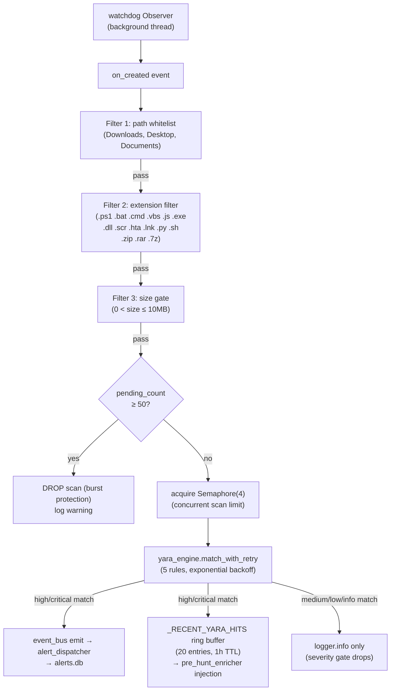

**Two-layer backpressure** prevents sensory-overload attacks:
1. `asyncio.Semaphore(4)` — limits concurrent YARA scans to 4
2. `_FIM_MAX_PENDING = 50` — drops scans if pending count exceeds threshold

**Severity gating** (`yara_engine.py`): only High/Critical matches reach the
Event Bus. Medium/Low/Info matches are logged locally and dropped — prevents
Alert Fatigue when ingesting external community rule packs. Default severity
= `high` if no meta key present (backward compat).

**Hot-reload**: `reload_rules()` re-compiles `.yar` files in a worker thread
with atomic swap (fail-soft). Two triggers: watchdog on `rules/yara/` (2s
debounce, local trust zone) and `POST /mcp/reload_yara` (SOAR/remote).

FIM is **decoupled from the DB layer** — scans are gated by the semaphore,
results emitted as events. This prevents a FIM burst from overwhelming DB
connection pools.

### 9.11 Proactive Threat Hunt

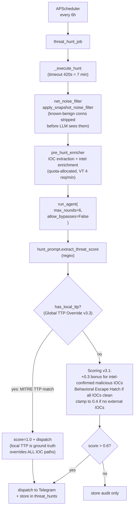

**Why `allow_bypasses=False`**: A proactive hunt must run the full ReAct loop —
short-circuiting to a bypass would defeat the purpose of proactive
investigation.

**Hallucination score cap** (`threat_score_cap.clamp_llm_score`):
evidence-gated dispatch. The LLM cannot declare a high threat score without
intel-confirmed IOCs. `+0.3` bonus only for IOCs confirmed malicious by VT or
AbuseIPDB; clamped to 0.4 if no external IOCs.

**Behavioral Escape Hatch** (`behavioral_escape_hatch.py`): Physical law —
"A clean network signature does NOT cancel a malicious behavioral signature."
When all IOCs are clean per intel (trusted-ISP + VT=0), the clamp is lifted
in tiers based on local behavioral anomalies: 0-1 → 0.40, 2-3 → 0.50,
4+ → 0.70 (dispatch), MITRE TTP → 1.00 (full override). Prevents false
negatives on Living-off-the-Trusted-Cloud attacks (Azure/AWS/GCP C2).

**Global TTP Override (v3.3):** `has_local_ttp()` is a top-level gate in
`_execute_hunt` BEFORE all IOC scoring paths. A MITRE TTP match forces
`score=1.0` + dispatch regardless of IOC status (no-IOC, mixed-IOC,
clean-IOC). Closes the blind spot where a LOLBin attacker with a fresh IP
(no IOC) was clamped to 0.4 and silenced. Local TTP is ground truth.

**Noise filter escape hatch** (C1+C2): Suppressed CDN/cloud connections are
tagged into `snapshot['filtered_net']` (not deleted). The Behavioral Escape
Hatch reads both `suspicious_net` AND `filtered_net` — cloud C2 suspects
remain visible to scoring even when invisible to IOC enrichment.

**Provenance skill normalization** (C3): `_normalize_tool_name()` bridges
skill naming gap (`skill_intel-skill` → `intel`) — all external skills
classified as tainted regardless of naming variant.

**SAFE_PROCESSES path verification** (C4): `_is_safe_system_process()`
verifies system processes run from `SystemRoot`. Malware in `C:\Temp\`
with spoofed name is killable (fail-closed on AccessDenied).

**Tier 2 fixes** (H1-H8):
- H1: PID-based self-process verification (4-layer path+lineage+hash).
- H2: Baseline TTL 90 days — prevents baseline poisoning invisibility.
- H3: recursive=True + 14 ignore patterns (cache/temp blacklist).
- H4: +8 executable extensions (.com/.pif/.wsf/.psm1/.vbe/.jse/.mht/.url).
- H5: YARA allowlist (rules/yara/allowlist.yml) — suppress FP by path/hash.
- H6: Provenance fail-closed — UNKNOWN tools treated as tainted (Zero Trust).
- H7: Kill-by-name disambiguation — refuses ambiguous multi-match kills.
- H8: Closed by C4 path verification in PID verify path.

**Tier 3 fixes** (M1-M11):
- M1: Behavioral filter path verification (chrome.exe spoofing defense).
- M3: Byzantine cross-verification — 2 trusted sources required to
  launder tainted entity (prevents single-tool compromise).
- M5: Global rate limit bucket (100 req/min) — IPv6 rotation defense.
- M6: Token exchange pattern — Basic Auth only at /api/auth/login,
  Bearer token (8h TTL) required for all other endpoints.
- M7: Brute-force lockout — 10 failed attempts → 15 min lockout.
- M8: Hunt trigger rate limit (5/min per IP) — resource exhaustion DoS.
- M9: OTP exponential backoff — 3 lockouts → 1h, 5 → 24h.
- M10: FIM scan size 10MB → 50MB (padded malware bypass).
- M11: Stable-size check before YARA scan (partial write race condition).

**Tier 4 fixes** (M2+M4):
- M2: net_baselines last_seen column (PRAGMA user_version=1 migration).
  ON CONFLICT DO UPDATE refreshes last_seen on every observation.
  is_known_combo uses last_seen for TTL + lazy eviction (DELETE expired).
- M4: LAN Zero Trust — is_loopback_ip (127.0.0.0/8 + ::1) vs
  is_private_ip (RFC1918). Loopback always blocked from firewall;
  RFC1918 CAN be blocked (lateral movement defense). LAN IPs included
  in threat enrichment (threat_classifier + intel_enricher).

### 9.12 Credential Leak Detection

| File | Lines | Purpose |
|------|-------|---------|
| `credential_monitor.py` | 280 | Monitors Pastebin/GitHub via OS search and free APIs. `_PASTE_SEMAPHORE=1` with jitter for anti-bot evasion. |
| `credential_format.py` | 76 | Formats scan results for ReAct observation text; extracted from `credential_monitor.py` to flatten nesting (cognitive complexity 40 -> 5 functions, all A/B grade). |
| `credential_patterns.py` | 94 | 5 regex families: email:password, AWS access keys, private keys, JWT tokens, DB connection strings. |
| `leak_scanner.py` | 295 | Scans via crt.sh, Wayback Machine, urlscan.io. |

### 9.13 Telemetry

**File**: `services/telemetry.py` (320 lines)

Self-observability for single-user deployment. Append-only JSONL file (max 5MB
with single backup). Records: LLM latency, tool execution time, process
resource usage. Rolling windows: latency samples, TPOT samples, context size
samples, loop lag samples. Lifetime counters: llm_calls, llm_errors (by class),
tool_calls, tool_errors.

**File**: `services/telemetry_utils.py` (94 lines) — error classification
(connection, timeout, http_5xx, rate_limit, context_overflow, bad_request,
http_4xx, other) + linear-interpolation percentile calculation.

---

## 10. OSINT Subsystem (Engine-in-Engine)

The OSINT subsystem runs its own ReAct loop *inside* the agent's ReAct loop
(engine-in-engine), with a 5-tier search waterfall:

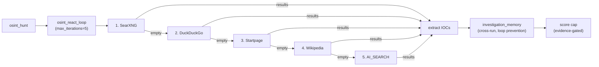

**Intent-based search routing**: IOC queries skip web search entirely (no
point searching Google for an IP — go straight to intel enrichment). Early exit
after 2 consecutive empty searches.

### 10.1 OSINT Components

| File | Lines | Purpose |
|------|-------|---------|
| `osint_react_loop.py` | 289 | Pure Python ReAct loop. Actions: intel, search, cve, extract, leaks, certs. Loop prevention via investigation memory. |
| `osint_hunter.py` | 110 | Orchestrates autonomous threat hunting with local baseline cross-reference + RDAP domain age (zero-day infra detection). |
| `osint_search.py` | 208 | OSINT search engine with intent-based routing. 5-tier waterfall. |
| `rdap_lookup.py` | 194 | Async RDAP domain age lookup. Domain < 30d = CRITICAL (zero-day infra on legit cloud IP), < 90d = SUSPICIOUS. |
| `nvd_enricher.py` | 204 | NVD NIST CVE enrichment (free, no key). CVSS, attack vector, affected products. Hard facts for LLM injection. |
| `ai_search.py` | 145 | AI web search via Gemma 4 31B IT through OpenRouter. Daily quota 200. DuckDuckGo + AI summarization. |
| `pre_hunt_enricher.py` | 431 | Pre-hunt deterministic enrichment. VT quota: 4 req/min, priority Hash > Domain > IPv4. `_MAX_CONCURRENT_ENRICH=5`, `_ENRICH_TIMEOUT_S=8.0`. `_is_malicious` defers to `is_clean_enrichment` (trusted-ISP guard); feed hits always win. |
| `pre_compute_router.py` | 265 | Generalizes pre_hunt_enricher to ALL agent queries. Intent detection ALWAYS runs (zero I/O). Enrichment ONLY when IOCs detected. |
| `reflection_agent.py` | 171 | Weekly Auto-Reflection (Friday 16:00). Queries last 7 days of error lessons, telemetry, threat hunt stats. |

---

## 11. Security & HITL

### 11.1 Action Tools (HITL-Protected Remediation)

**Location**: `services/action_tools/`

2-level safety: **safe** (parallel) vs **critical** (serial, HITL approval
required). Critical tools require Telegram approval via `pending_actions.db`.

### 11.2 Remediation Engine (Titanium Cage)

**File**: `services/remediation_engine.py` (142 lines)

Hardcoded whitelists: `SAFE_PROCESSES`, `SAFE_IPS`. Windows-native commands
only. `kill_process()` and `block_ip_in_firewall()` functions.

### 11.3 Two-Factor Authentication (Step-Up)

**File**: `services/two_factor.py` (272 lines)

Step-up authentication for sensitive C2 operations.

| Constant | Value | Purpose |
|----------|-------|---------|
| `_CHALLENGE_TTL` | 60 s | Challenge time-to-live |
| `_MAX_VERIFY_ATTEMPTS` | 3 | Max verification attempts |
| `_OTP_COOLDOWN` | 30 s | OTP cooldown |
| `_OTP_MAX_PER_WINDOW` | 3 | Max OTPs per window |
| `_LOCKOUT_COOLDOWN` | 60 s | Lockout cooldown |

### 11.4 Web C2 Dashboard

**Location**: `services/web_c2*.py` (6 files)

aiohttp LAN dashboard with token-based auth (Basic→Bearer exchange, 8h TTL),
IP whitelist (RFC1918 only), and rate limiting. Frontend (`static/index.html`)
implements client-side auth: login modal, localStorage token, `secureFetch()`
with Bearer injection, SSE token via query string, session countdown timer,
and auto-lock on 401/403. `GET /` serves HTML shell without auth; all API
endpoints require Bearer token. `POST /api/auth/logout` revokes the session.
`WEB_C2_HOST=0.0.0.0` enables LAN access (IP whitelist blocks non-RFC1918).

### 11.5 Local MCP Server

**File**: `services/local_mcp_server.py` (10697 lines) +
`local_mcp_telegram_route.py` (2647 lines)

Exposes Sentinel tools via MCP on port 11123. Telegram route bridges MCP
requests to Telegram delivery.

### 11.6 Telegram Channel

**Location**: `services/telegram/` (aiogram 3.x)

- DM + group support
- `mcp_bridge` for MCP client integration
- FSM states for deterministic multi-step flows (`ExecApproval.waiting_for_auth`
  for HITL approval)
- Slash commands: /start, /skills, /help, /intel, /stats
- Universal Token Bucket protection on all outbound sends
- FloodWait retry (max 3 attempts)

### 11.7 Night Watchman (Memory Compaction)

**File**: `services/night_watchman.py` (212 lines)

Runs 04:30 daily via APScheduler. Compresses old conversations into
bullet-point summaries. `_MAX_CHUNK_CHARS = 4000`.

---

## 12. Architectural Constraints & Gates

### 12.1 Import Linter Contracts

Enforced via `import-linter` in `pyproject.toml` (`[tool.importlinter]`) — prevents forbidden dependencies:

| Contract | Source | Forbidden |
|----------|--------|-----------|
| `db-pool-isolation` | `services.db_pool` | agent, telegram, llm_bridge, local_mcp_server |
| `memory-isolation` | bot_memory, memory_store, memory_db, error_memory, osint_memory | agent, telegram |
| `agent-no-telegram-ui` | services.agent, services.tools | telegram.handlers, callbacks, routing |
| `skills-no-services-direct` | skills | services (subprocess isolation) |

### 12.2 Complexity & File-Length Gates

| Gate | Tool | Threshold |
|------|------|-----------|
| Cyclomatic complexity | xenon | Max absolute: D, average: B, modules: C |
| File length (LLOC) | `file_length_gate.py` | Max 300 LLOC per file (SRP); tests 500 LLOC |
| Dead code | vulture | Min confidence 80% |
| Type check | mypy | Baseline-gated (blocks new errors) |
| Security SAST | bandit | Medium/High severity blocked |
| Dependency audit | pip-audit | CVE/GHSA/PYSEC (blocking) |
| Lock sync | `bin/lock_sync_check.py` | Fails if `requirements.txt` (auto-generated artifact) drifts from `uv.lock` |
| Lint + format | ruff | Python linting + formatting |

**LLOC gate counts Logical Lines of Code** — excludes blanks, comments, and
docstrings. A file with 402 physical lines may be 287 LLOC and pass. The
ratchet baseline (`.file_length_baseline.txt`) is empty: no files currently
exceed the threshold.

### 12.3 Key Design Patterns

| Pattern | Location |
|---------|----------|
| Singleton (thread-safe) | LLMBridge, EmbeddingService, SkillsEngine, Telemetry |
| Circuit Breaker (4-state) | llm_bridge, agent `_nodes/circuit_breaker` |
| Shared Resource Pool | `_custom_http_client` (httpx, max_connections=5) |
| FSM State Machine | agent `_agent_loop`, threat_hunter |
| Chain of Responsibility | bypass system (17 handlers) |
| Hybrid Routing (semantic + keyword) | agent `routing/` |
| Producer-Consumer | monitor_loop → alert_queue → llm_analysis_worker |
| Event Bus (pub/sub) | sentinel_events |
| Hexagonal Architecture (Ports & Adapters) | `interfaces.MessageGateway` |
| Connection Pool | `db_pool.DBPool` |
| Gated EMA (poisoning-resistant) | ema_baseline |
| HNSW Vector Search | vectorlite (bot_memory) |
| HITL (Human-in-the-Loop) | pending_actions, action_tools |
| Zero-Trust Temp File Bridge | agent `_nodes/_temp_file_bridge` |
| Closed-Loop Learning | error_memory → _tool_ranker → circuit_breaker |
| Dynamic ReAct Budget | `react_budget.compute_budget` (3–10 iterations) |
| Hallucination Score Cap | `threat_score_cap.clamp_llm_score` |
| Pre-Hunt Deterministic Enrichment | `pre_hunt_enricher` |
| Deterministic Tool-Claim Audit | `_agent_tool_audit._audit_tool_claims` |
| Provenance Tracking | `_provenance.py` (trusted vs tainted tools) |
| Injection Anomaly Scorer | `_injection_anomaly.py` (6 weighted signals) |

### 12.4 Design Philosophy

1. **Local-first.** No cloud API calls for reasoning. The model, embeddings,
   vector search, and all databases run on-device. Cloud is only for intel
   enrichment (VirusTotal, AbuseIPDB) and translation fallback.
2. **Determinism over LLM judgment.** Every decision that *can* be made with
   regex/keywords/SQL *is*. The LLM is reserved for reasoning that genuinely
   requires it — and even then, its output is audited (tool-claim audit,
   hallucination score cap, entity audit).
3. **Fail-soft, never crash.** Circuit breakers, emergency trims, graceful
   degradation, dead-letter queues, and a 4-state CB mean the bot degrades to
   "slower but still answering" rather than "dead."
4. **Closed-loop learning.** Tool failures → `error_memory` (cosine-deduped
   lessons) → `_tool_ranker` (7-day half-life decay) → circuit breaker. The
   agent gets better at picking tools without a single fine-tune.
5. **Hebrew-first.** OCR, translation, keyword routing, and prompt anchoring
   all treat Hebrew as the primary language. Cyber terminology stays English
   inside Hebrew reports (deterministic anchoring) to prevent the 4B model
   from translating "MITRE ATT&CK" into malformed Hebrew.

---

## Appendix — The Unifying Principle

> **Move determinism out of the LLM and into Python.**

Every architectural decision in Sentinel flows from this. On a 70B cloud model,
regex intent routers and pre-compute enrichment are nice-to-haves. On a 4B
model with 16K context and 6 GB VRAM, they are the difference between a working
agent and a toy.

| Decision | LLM cost | Deterministic cost |
|----------|----------|---------------------|
| Which tool to call | 1 LLM round-trip (unreliable on 4B) | 0 — regex intent router |
| Is this IP malicious? | LLM hallucinates a score | 0 — VT/AbuseIPDB pre-compute |
| Which 55 tools to show? | LLM sees all 55, picks wrong | 0 — visibility filter → 5–10 |
| "What's the weather?" | LLM round-trip + tool call | 0 — bypass returns verbatim |
| Context overflow recovery | crash | 0 — emergency trim + retry |
| Is this prompt injection? | LLM judges (unreliable) | 0 — anomaly scorer (6 signals) |
| Should this PID be killed? | LLM decides (dangerous) | 0 — provenance gate (trusted vs tainted) |

Every row in that table is a token saved and a hallucination prevented.

---

## Appendix B — GBNF Grammar Spike (2026-07-24)

A spike tested whether GBNF grammar enforcement could eliminate the 85%
structural ReAct failures (no `Action:` line, broken JSON). Key finding:
KoboldCpp's OpenAI chat completions endpoint does **not** reliably enforce
grammar (unescaped quotes pass through), while the raw Kobold API does.
The grammar works with zero latency penalty, but reliable enforcement
requires switching to the raw API — deferred as a medium-sized change.
The harness (`tests/golden/`) is preserved as golden-transcript test
infrastructure.

---

## Appendix C — Mutation Testing Spike (2026-07-25)

Cosmic-ray mutation testing on 5 core security modules. Key finding:
the only module passing the 85% threshold was `is_powershell_safe`,
developed with strict TDD (tests written **before** implementation).
All post-hoc tested modules scored 40-83%. This is empirical evidence
that TDD-first produces measurably stronger test suites.

`two_factor` (the most security-critical module — C2 hijacking defense)
was triaged and improved: 32 boundary tests added, score raised from
40% to 73% (above 70% threshold). A production bug in `_cleanup_expired`
(TypeError on unhashable dataclass) was also discovered and fixed.

No permanent mutation-testing gate added; surviving mutants documented
as backlog. TDD-first policy adopted for new security-critical modules.

---

## Appendix D — Sysmon/ETW Spike (2026-07-25)

Spike to replace psutil polling with real-time Sysmon telemetry. Three
approaches evaluated: polling, EvtSubscribe (push on Event Log), ETW native
(PyETWkit). **Selected EvtSubscribe** — push semantics with only pywin32
dependency (no Rust wheel, no single-maintainer risk).

Results: 0% burst loss (200/200 events), 100% asyncio bridge delivery
(302/302), median bridge latency 203ms. Sysmon v15.21 installed with
minimal config (Event 1 only). pywin32 DLL bootstrap added to
`_winutil.py` for venv compatibility.

Next: production consumer feeding `cmdline_analyzer`/`mitre_mapper`,
startup health check, expansion to Network/Image/Registry events.
